# Lab ARSW1 
## Daniel RIcardo Ruge Gomez

## Parte I

## 1.  

  

## 2.  

i

ii y iii

iv

## Explicación

Cuando se usa start(), se crea un hilo en el sistema operativo. La JVM le pide al SO un hilo nuevo, y este comienza a ejecutar el método run() al mismo tiempo que el flujo principal del programa, haciendo que el orden de ejecución de los hilos sea impredecible.

En cambio, cuando se usa run() directamente, no se crea un nuevo hilo: simplemente el mismo hilo principal (main) ejecuta el código. Por eso, la ejecución se vuelve secuencial.

 ## Parte II - Ejercicio Black List Search

  ## 1. 
    Declaración de la clase, el constructor y el metodo run()

  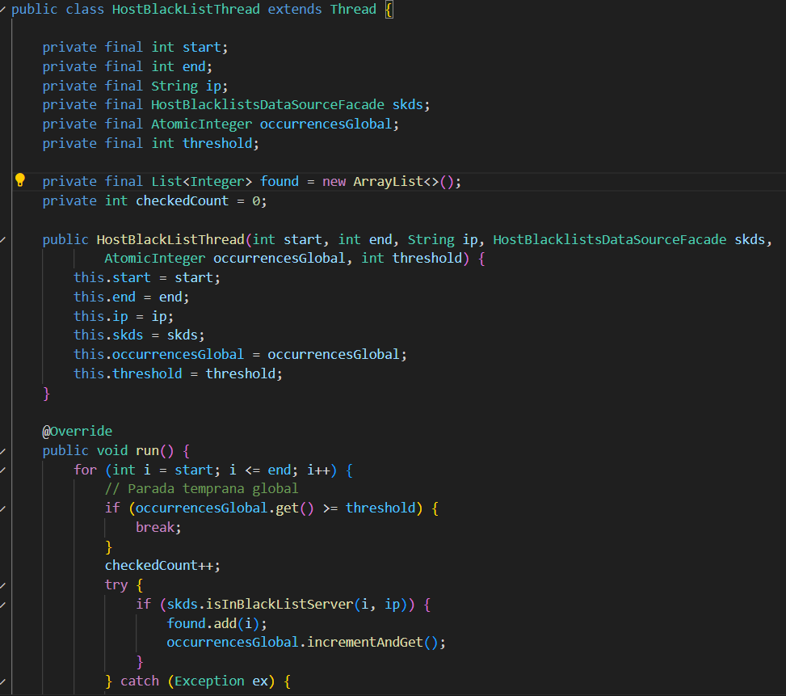

    Metodos que preguntan cuántas ocurrencias/chequeos hicieron.

  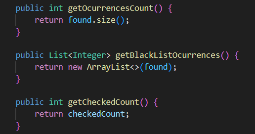

    checkHost ahora recibe el parámetro N y haces validaciones.

  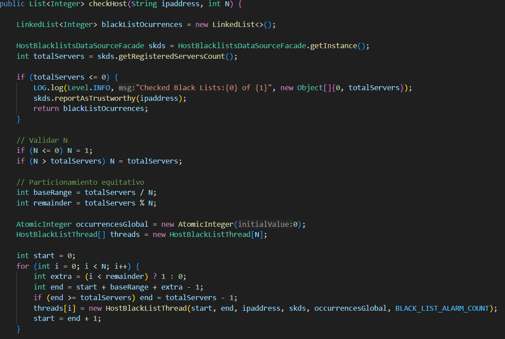

  ## 2.

    Lanzamiento de los hilos y LOG

  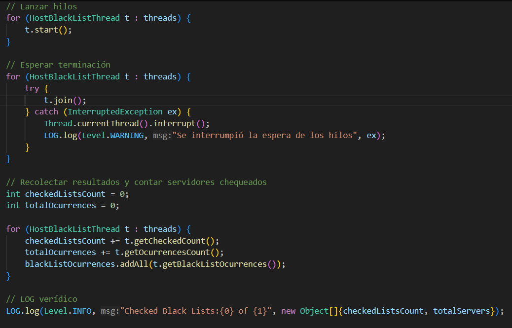

    Salida
  
  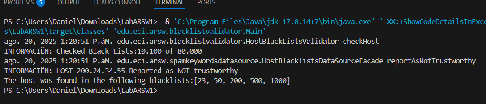

 ## Parte II.I

   Se podría modificar la implementación introduciendo un contador global compartido que todos los hilos consulten antes de seguir buscando. De esta forma, cuando ya se llegue al mínimo requerido de ocurrencias, los demás hilos pueden detenerse inmediatamente, aunque se deberia tener en cuenta la coordinación y sincronización entre hilos para evitar condiciones de carrera al acceder a ese contador compartido.

## Parte III - Evaluación de Desempeño

  1 hilo

  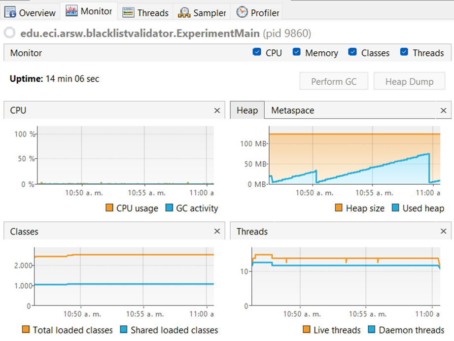

  4 hilos

  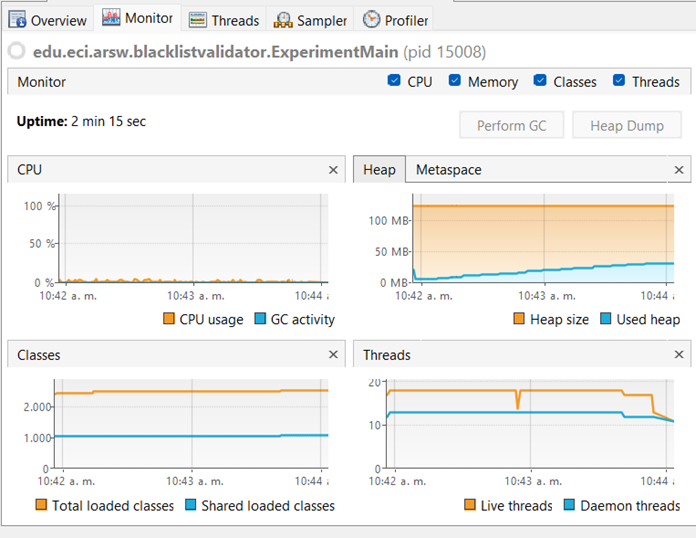

  8 hilos

  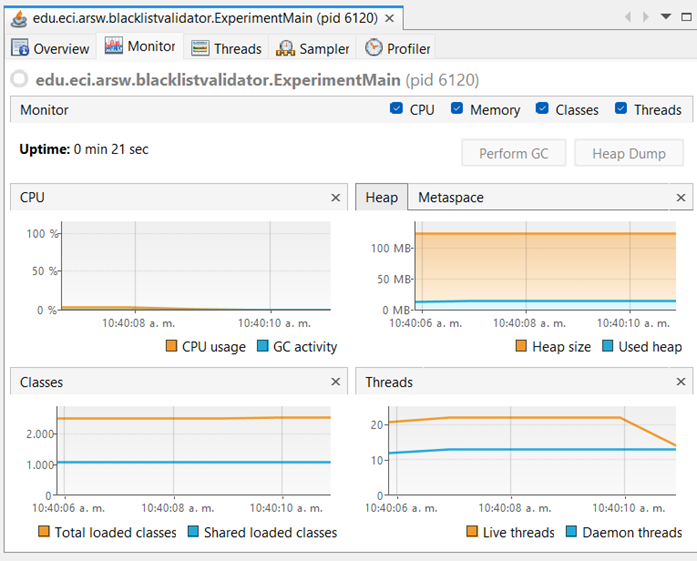

  50 hilos

  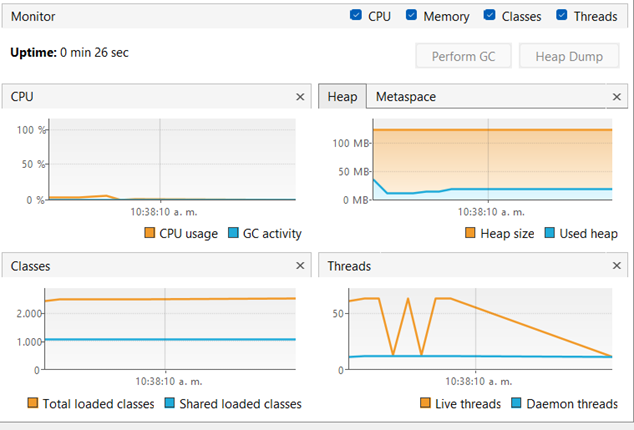

  100 hilos

  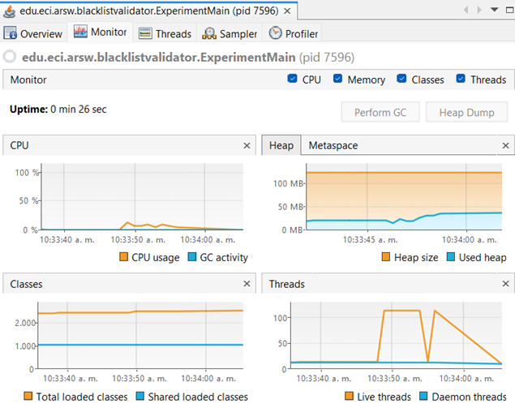

  ## grafica 

  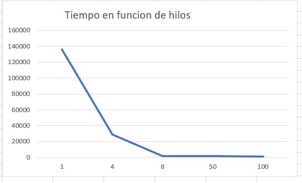

  ## Hipotesis

  Al ver la gráfica uno podría pensar que mientras más hilos se usen, más rápido se ejecuta el programa porque se está trabajando en paralelo. Pero en realidad esto no siempre es así, ya que crear y manejar muchos hilos también tiene un costo y además depende de cuántos núcleos tenga el procesador. Por eso, aunque al principio los tiempos bajen, después puede pasar lo contrario y tardar más."

  ## Parte IV - Ejercicio Black List Search

    1) ¿Por qué no ganamos con 500 hilos? ¿y vs 200?

Amdahl dice que subir hilos ayuda hasta que el “pedazo secuencial” y los costos extra te frenan. Con 500 hilos en una máquina con pocos  hay  colisiones por CPU, caches que se pisan, más sincronización (sumar ocurrencias, juntar listas) lo cual en vez de acelerar, se estanca o empeora. Con ~200 hilos ya se está más que saturado; subir a 500 casi no suma y puede restar.

    2) ¿Igual a núcleos vs el doble de hilos?

Si el trabajo es CPU-bound, lo óptimo suele ser = núcleos. Poner el doble puede llegar a  ayudar un poco , porque mientras unos esperan otros corren, pero normalmente el extra se come en overhead. 

    3) ¿Y si en vez de 100 hilos en 1 CPU uso 1 hilo en 100 máquinas? ¿o c hilos en 100/c máquinas?

depende, si el problema es “vergonzosamente paralelo” y la comunicación es mínima, repartir en muchas máquinas sí escala mejor por que habria menos competencia por CPU y caché, Pero metes overhead nuevo: coordinar, enviar trabajos, recolectar resultados, posibles cuellos de botella de red o del servicio central.