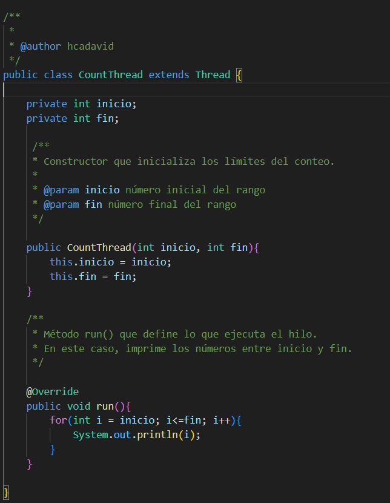
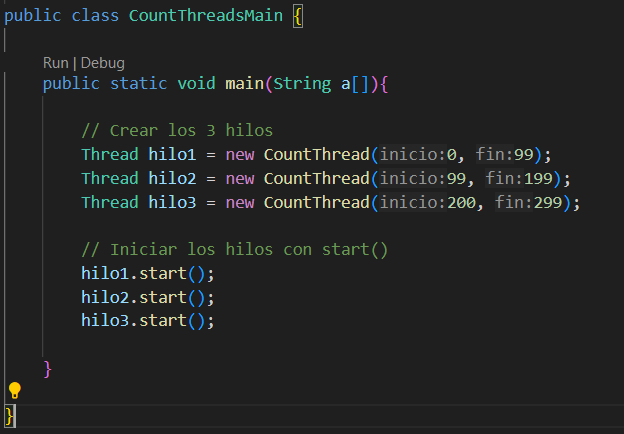
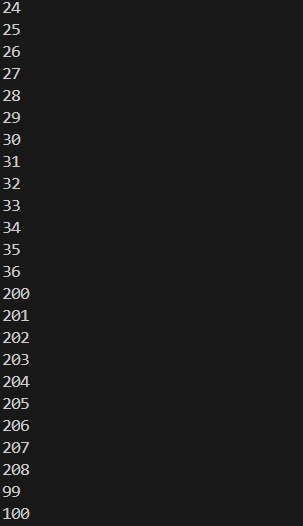
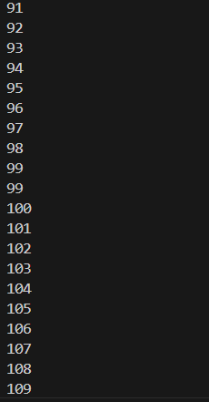

# LabARSW1

## Parte I

1.  

  

2.  

i

ii y iii

iv

## Explicación

Cuando se usa start(), se crea un hilo en el sistema operativo. La JVM le pide al SO un hilo nuevo, y este comienza a ejecutar el método run() al mismo tiempo que el flujo principal del programa, haciendo que el orden de ejecución de los hilos sea impredecible.

En cambio, cuando se usa run() directamente, no se crea un nuevo hilo: simplemente el mismo hilo principal (main) ejecuta el código. Por eso, la ejecución se vuelve secuencial.